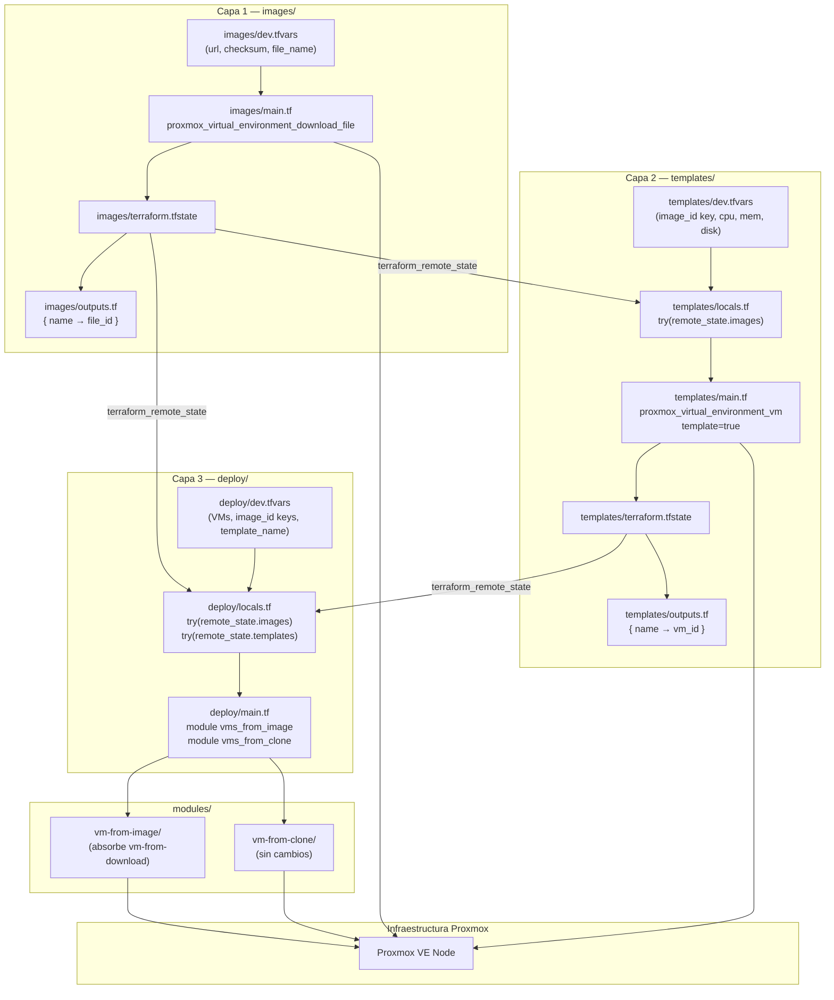

# Plan de implementación: Arquitectura IaC en capas

## Arquitectura resultante




Cada capa tiene su propio estado Terraform. `make destroy` solo destruye la capa 3 (VMs). Las capas 1 y 2 son independientes y persisten.

---

## Archivos que se eliminan

- `modules/vm-from-download/` — eliminado completamente (toda la carpeta)

---

## Archivos que se renombran

- `README.md` → `README_old.md`

---

## Archivos que se modifican

### `modules/vm-from-image/variables.tf`

- En el tipo del mapa `vms`: `os_image: string` → `image_id: string`
- Eliminar variable `dns_servers` (declarada pero no usada en `main.tf`)

### `modules/vm-from-image/main.tf`

- Línea 26: `file_id = "local:iso/${each.value.os_image}.img"` → `file_id = each.value.image_id`
- El módulo recibe el `file_id` ya resuelto; no construye rutas

### `deploy/main.tf`

- Eliminar el bloque `module "vms_from_download"` completo
- `module "vms_from_image"`: pasar `vms` con `image_id` resuelto via `local.images`:

```hcl
  vms = {
    for k, v in var.vms_from_image : k => merge(v, {
      image_id = local.images[v.image_id]
    })
  }
  

```

- `module "vms_from_clone"`: `template_vm_id = local.template_ids[var.template_name]`
- Eliminar `dns_servers` del paso al módulo `vms_from_image`

### `deploy/variables.tf`

- `vms_from_image`: campo `os_image` → `image_id`
- Eliminar variable `vms_from_download`
- Eliminar variable `template_vm_id`
- Eliminar variable `dns_servers`
- Añadir `variable "template_name" { type = string; default = "" }`

### `deploy/outputs.tf`

- Eliminar `output "vms_from_download_ips"` (módulo eliminado)

### `deploy/dev.tfvars`

- En cada VM de `vms_from_image`: `os_image = "..."` → `image_id = "ubuntu-24-04"` (short name)
- Eliminar bloque `vms_from_download`
- `template_vm_id = 400` → `template_name = "ubuntu-noble-template"`
- Eliminar `dns_servers`

### `deploy/pro.tfvars`

- Mismos cambios que `dev.tfvars`: `os_image` → `image_id`, eliminar `vms_from_download`, `template_vm_id` → `template_name`, eliminar `dns_servers`

### `makefile`

- Añadir variables: `IMAGES_DIR = images`, `TEMPLATES_DIR = templates`
- Añadir targets nuevos (misma lógica de confirmación que los existentes; `destroy-images` y `destroy-templates` usan recuadro rojo):
  - `init-images`, `download-images`, `destroy-images`
  - `init-templates`, `build-templates`, `destroy-templates`
- Añadir sección en `help` para los nuevos targets
- Añadir a `.PHONY`

---

## Archivos que se crean

### `deploy/locals.tf`

```hcl
data "terraform_remote_state" "images" {
  backend = "local"
  config  = { path = "../images/terraform.tfstate" }
}
data "terraform_remote_state" "templates" {
  backend = "local"
  config  = { path = "../templates/terraform.tfstate" }
}
locals {
  static_images = {
    "ubuntu-24-04" = "local:iso/ubuntu-24-04-server-cloudimg-amd64.img"
  }
  images       = merge(local.static_images, try(data.terraform_remote_state.images.outputs.image_ids, {}))
  template_ids = try(data.terraform_remote_state.templates.outputs.template_ids, {})
}
```

El `try()` hace que `deploy/` funcione aunque `images/` o `templates/` no tengan estado aún. Solo fallará si se intenta usar una imagen descargada o template que no existe.

### `images/main.tf`

`proxmox_virtual_environment_download_file` con `for_each = var.images`, `file_name = each.value.file_name` explícito.

### `images/variables.tf`

Variables: `images` (map con `url`, `checksum`, `file_name`), `proxmox_node`, `files_datastore_id`.

### `images/outputs.tf`

```hcl
output "image_ids" {
  value = { for k, v in proxmox_virtual_environment_download_file.image : k => v.id }
}
```

### `images/versions.tf` y `images/providers.tf`

Copias de los existentes en `deploy/`.

### `images/dev.tfvars` y `images/pro.tfvars`

Entradas de imágenes con `url`, `checksum`, `file_name`. El `file_name` controlado explícitamente es el punto de sincronización con `deploy/locals.tf`.

### `templates/main.tf`

`proxmox_virtual_environment_vm` con `template = true`, `started = false`, `on_boot = false`. Disk usa `file_id = local.images[each.value.image_id]`.

### `templates/variables.tf`

Variables: `templates` (map con `vm_id`, `image_id`, `cpu_cores`, `memory_mb`, `disk_size`), `proxmox_node`, `disk_datastore_id`, `network_bridge`.

### `templates/outputs.tf`

```hcl
output "template_ids" {
  value = { for k, v in proxmox_virtual_environment_vm.template : k => v.vm_id }
}
```

### `templates/locals.tf`

Lee `images/terraform.tfstate` via `terraform_remote_state` + merge con static_images (igual que `deploy/locals.tf`).

### `templates/versions.tf` y `templates/providers.tf`

Copias de los existentes en `deploy/`.

### `templates/dev.tfvars` y `templates/pro.tfvars`

Definición de templates: `vm_id`, `image_id` (short name), hardware.

---

## READMEs — estructura jerárquica

Cada nivel explica lo propio y, al subir, añade contexto arquitectónico.

### `modules/vm-from-image/README.md`

Scope: el módulo. Inputs/outputs, qué recursos crea, qué espera recibir (`image_id` como `file_id` completo), limitaciones.

### `modules/vm-from-clone/README.md`

Scope: el módulo. Inputs/outputs, prerequisito del template, cómo funciona el cloud-init en clones.

### `modules/README.md`

Scope: la capa de módulos. Qué es un módulo Terraform en este contexto, cómo se consumen desde `deploy/`, qué módulos hay y cuándo usar cada uno. No documenta infraestructura concreta.

### `images/README.md`

Scope: la capa 1. Qué hace, variables en `dev.tfvars`, flujo (`make download-images`), cómo el `file_name` se sincroniza con `deploy/locals.tf`, qué ocurre en re-ejecuciones.

### `templates/README.md`

Scope: la capa 2. Qué hace, prerequisito de `images/`, variables en `dev.tfvars`, idempotencia, cómo el output `template_ids` llega a `deploy/`.

### `deploy/README.md`

Scope: la capa 3. Guía práctica de uso diario: cómo configurar VMs en `dev.tfvars`, el catálogo de `locals.tf`, flujo de `make apply/destroy`, cómo añadir una VM nueva. Referencias a `images/` y `templates/` cuando se necesita contexto previo.

### `README.md` (raíz, nuevo)

Scope: el proyecto completo. Incluye:

- Qué es el proyecto y qué tecnologías usa
- Diagrama de la arquitectura en capas
- Explicación del flujo de estados y `terraform_remote_state`
- Requisitos previos
- Flujo de trabajo completo (primera vez vs día a día)
- Referencia de comandos `make`
- Cómo añadir imágenes, templates y VMs nuevas
- Seguridad: credenciales, `.gitignore`
- Sección Packer (sin cambios respecto al actual)

---

## Flujo de trabajo resultante

```
# Primera vez:
make init-images && make download-images ENV=dev
make init-templates && make build-templates ENV=dev
make init && make apply ENV=dev

# Día a día:
make apply ENV=dev      # crea/modifica VMs
make destroy ENV=dev    # solo destruye VMs; imágenes y templates intactos

# Añadir una imagen nueva:
# 1. Añadir entrada en images/dev.tfvars
# 2. Añadir entrada en deploy/locals.tf (static_images)
# 3. make download-images ENV=dev

# Añadir un template nuevo:
# 1. Añadir entrada en templates/dev.tfvars
# 2. make build-templates ENV=dev
```

